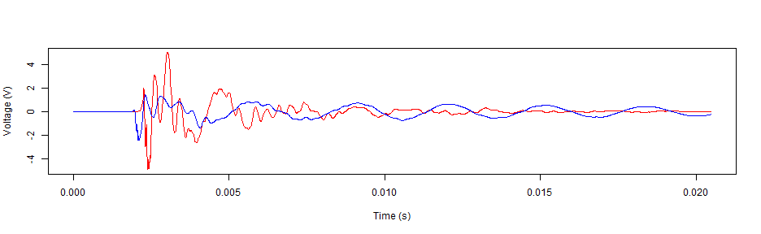
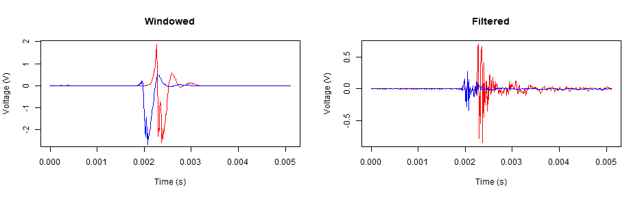

## Background

Surface waves can be very descriptive of the material they are passing through if the source of the waves is instantaneous.  An instantaneous impact creates a measurable spike in time, which infers infinite frequency content in the resulting wave.  If the impact is not instantaneous, there may not be enough frequency content to infer properties of the material through surface wave analysis.  Applying a bandpass filter can mitigate this effect by emphasizing uniformity in the frequency range, or power spectrum.  

A Shiny App was created to apply a bandpass filter to two surface wave traces (near and far), and observe the resulting frequency content (power spectrum) of the traces.  Linear regression lines applied to the power spectrum indicate maximized uniformity when the slope of the line approaches zero.  When the sum of the slopes in two power spectrums is minimized, both spectrums are mutually ideal for infering properties about the material.  Adjust the regression lines by moving the "Frequency" slider in the SideBar Panel.

The App is located here:

https://abistline.shinyapps.io/Time-to-Frequency_Demo

--- .class #id 

## Raw Traces

Traces measuring displacement in concrete as it is impacted with a 1-lb ballpeen hammer.  Blue is from a sensor positioned 1 foot from the hammer; red from a sensor positioned 3.5 feet from the hammer. 


```r
plot(f$time, f$stack, type="l", col="red", xlab="Time (s)", ylab="Voltage (V)")
lines(n$time, n$stack, type="l", col="blue", xlab="Time (s)", ylab="Voltage (V)")
```



--- .class #id

## Extracting the Surface Wave from the Trace

The surface wave makes up roughly 67% of the energy in the trace and is visible as the first large negative peak.  It can be extracted through windowing, or through applying a bandpass filter.  Windowing retains low frequencies that bias Surface Wave analysis.


```r
par(mfcol=(c(1, 2)))
plot(sf$time, sfsw, type="l", col="red", xlab="Time (s)", ylab="Voltage (V)", main="Windowed")
lines(sn$time, snsw, type="l", col="blue")
plot(sf$time, sfbp, type="l", col="red", xlab="Time (s)", ylab="Voltage (V)", main="Filtered")
lines(sn$time, snbp, type="l", col="blue")
```



--- .class #id

## Example Result

The Surface Wave velocity can be extracted as a function of wavelength (pseudo depth).


